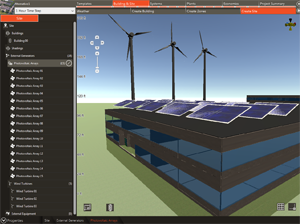

# 2020-07-11 gbXML Webinar

The Green Building XML organization is presenting a Green Building XML (gbXML) webinar on July 16, 2020 from 1 to 2 pm EST. This webinar is targeted toward energy modelers, engineers, architects, software vendors, and generally anyone who is interested in learning about Trane TRACE 3D Plus, Perkins and Will's new SPEED software tool, and gbXML.

The agenda will be as follows:

1. Overview of gbXML by Stephen Roth

2. Presentation by Jim Spielbauer of Trane Technologies demoing the new [TRACE 3D Plus]( https://www.trane.com/commercial/north-america/us/en/products-systems/design-and-analysis-tools/analysis-tools/trace-3d-plus.html ) desktop software using gbXML. TRACE™ 3D Plus is a next generation building design and analysis software program that delivers faster, more accurate results through a seamless workflow that closely aligns with today's building process: https://www.trane.com/commercial/north-america/us/en/products-systems/design-and-analysis-tools/analysis-tools/trace-3d-plus.html

3. Presentation by Ben Welle of Perkins and Will demoing the new SPEED (Simulation Platform for Energy Efficient Design) web- and cloud-based software tool using gbXML. SPEED is a web-based and cloud-based energy/daylighting/solar design and simulation platform for early design developed for architects enabling a 1-day turn-around from design question to a data-driven design answer: https://speed.perkinswill.com/

4. Q&A
